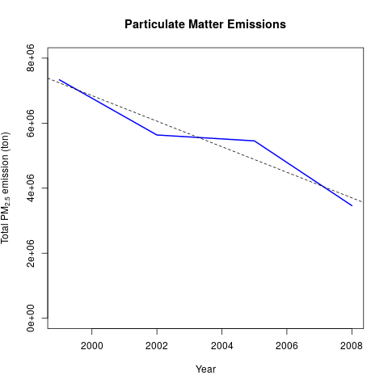
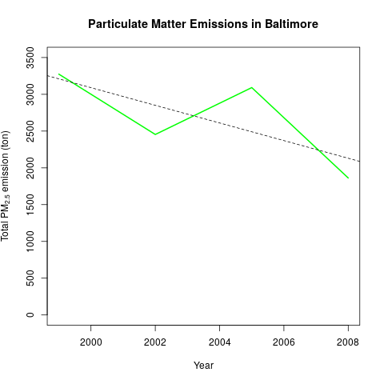
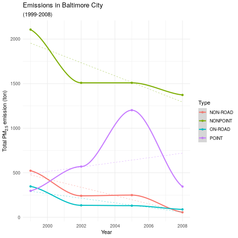
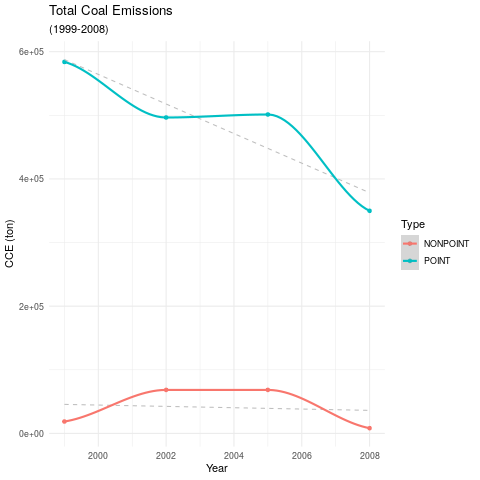
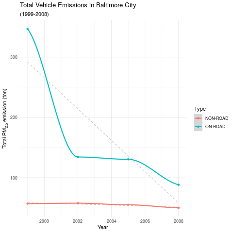
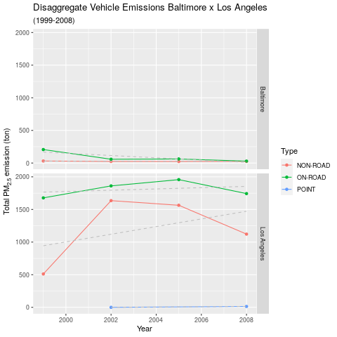
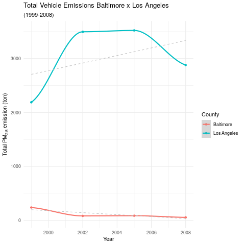

Particulate Matter Emissions
================

> The overall goal of this project is to explore the National Emissions
> Inventory database and see what it say about fine particulate matter
> pollution in the United states over the 10-year period 1999–2008.

## Tools Used

  - R language compiler
  - R base graphic devices
  - Tidyverse library packages
  - RMarkdown library package

## Files

  - **Raw data set**: [Environmental Protection Agency National
    Emissions
    Inventory](https://d396qusza40orc.cloudfront.net/exdata%2Fdata%2FNEI_data.zip)
  - **[CODEBOOK.md](https://github.com/vcwild/pm-emissions/blob/master/CODEBOOK.md)**:
    step-by-step book explaining the code
    processing.
  - **[plot<sub>num</sub>.png](https://github.com/vcwild/pm-emissions/tree/master/images)**:
    the plotted
    files
  - **[plot<sub>num</sub>.R](https://github.com/vcwild/pm-emissions/tree/master/scripts)**:
    the scripts that produces the [plotted
    images](https://github.com/vcwild/pm-emissions/tree/master/images)
  - **[script.Rmd](https://github.com/vcwild/pm-emissions/blob/master/script.Rmd)**: the script to build the project from source

## Build from Source

Inside the project root folder, execute the following

```
R
library(rmarkdown)
rmarkdown::render("script.Rmd", "html_document")
```

## CODEBOOK

### Initial Steps

Pick libraries to use in the
    project

``` r
library(tidyverse)
```

    ## ── Attaching packages ───────────────────────────────────────────────────────────────────────────────────────────────────── tidyverse 1.3.0 ──

    ## ✓ ggplot2 3.3.0     ✓ purrr   0.3.3
    ## ✓ tibble  3.0.0     ✓ dplyr   0.8.5
    ## ✓ tidyr   1.0.2     ✓ stringr 1.4.0
    ## ✓ readr   1.3.1     ✓ forcats 0.5.0

    ## ── Conflicts ──────────────────────────────────────────────────────────────────────────────────────────────────────── tidyverse_conflicts() ──
    ## x dplyr::filter() masks stats::filter()
    ## x dplyr::lag()    masks stats::lag()

Download and extract data set from EPA National Emissions Inventory
(USA)

``` r
download.file(url = "https://d396qusza40orc.cloudfront.net/exdata%2Fdata%2FNEI_data.zip", destfile = "mydata.zip")
unzip("mydata.zip", exdir = "./data")
file.remove("mydata.zip")
```

Read tables into the Environment

``` r
# National Emissions Inventory (NEI)
nei <- read_rds("./data/summarySCC_PM25.rds")
# Source Classification Code (SCC)
scc <- read_rds("./data/Source_Classification_Code.rds")
```

See a glimpse of the content

``` r
glimpse(nei)
```

    ## Rows: 6,497,651
    ## Columns: 6
    ## $ fips      <chr> "09001", "09001", "09001", "09001", "09001", "09001", "0900…
    ## $ SCC       <chr> "10100401", "10100404", "10100501", "10200401", "10200504",…
    ## $ Pollutant <chr> "PM25-PRI", "PM25-PRI", "PM25-PRI", "PM25-PRI", "PM25-PRI",…
    ## $ Emissions <dbl> 15.714, 234.178, 0.128, 2.036, 0.388, 1.490, 0.200, 0.081, …
    ## $ type      <chr> "POINT", "POINT", "POINT", "POINT", "POINT", "POINT", "POIN…
    ## $ year      <int> 1999, 1999, 1999, 1999, 1999, 1999, 1999, 1999, 1999, 1999,…

``` r
glimpse(scc)
```

    ## Rows: 11,717
    ## Columns: 15
    ## $ SCC                 <fct> 10100101, 10100102, 10100201, 10100202, 10100203,…
    ## $ Data.Category       <fct> Point, Point, Point, Point, Point, Point, Point, …
    ## $ Short.Name          <fct> "Ext Comb /Electric Gen /Anthracite Coal /Pulveri…
    ## $ EI.Sector           <fct> Fuel Comb - Electric Generation - Coal, Fuel Comb…
    ## $ Option.Group        <fct> , , , , , , , , , , , , , , , , , , , , , , , , , 
    ## $ Option.Set          <fct> , , , , , , , , , , , , , , , , , , , , , , , , , 
    ## $ SCC.Level.One       <fct> External Combustion Boilers, External Combustion …
    ## $ SCC.Level.Two       <fct> Electric Generation, Electric Generation, Electri…
    ## $ SCC.Level.Three     <fct> Anthracite Coal, Anthracite Coal, Bituminous/Subb…
    ## $ SCC.Level.Four      <fct> "Pulverized Coal", "Traveling Grate (Overfeed) St…
    ## $ Map.To              <dbl> NA, NA, NA, NA, NA, NA, NA, NA, NA, NA, NA, NA, N…
    ## $ Last.Inventory.Year <int> NA, NA, NA, NA, NA, NA, NA, NA, NA, NA, NA, NA, N…
    ## $ Created_Date        <fct> , , , , , , , , , , , , , , , , , , , 6/6/2003 0:…
    ## $ Revised_Date        <fct> , , , , , , , , , , , , , , , , , , , , , , , , , 
    ## $ Usage.Notes         <fct> , , , , , , , , , , , , , , , , , , , , , , , , ,

### Questions:

*Have total emissions from PM2.5 decreased in the United States from
1999 to 2008? Using the base plotting system, make a plot showing the
total PM2.5 emission from all sources for each of the years 1999, 2002,
2005, and 2008.*

-----

Look for years tracked in inventory

``` r
unique(nei$year)
```

    ## [1] 1999 2002 2005 2008

Filter total emissions for each year

``` r
total_emissions <- nei %>% 
    group_by(year) %>% 
    summarize(
        sum_emissions = sum(Emissions)
    )

total_emissions
```

    ## # A tibble: 4 x 2
    ##    year sum_emissions
    ##   <int>         <dbl>
    ## 1  1999      7332967.
    ## 2  2002      5635780.
    ## 3  2005      5454703.
    ## 4  2008      3464206.

Change column *sum\_emissions* to integer

``` r
total_emissions <- total_emissions %>% 
    mutate_at(vars(sum_emissions), as.integer)
total_emissions
```

    ## # A tibble: 4 x 2
    ##    year sum_emissions
    ##   <int>         <int>
    ## 1  1999       7332966
    ## 2  2002       5635780
    ## 3  2005       5454703
    ## 4  2008       3464205

Make a barplot with the sum of emissions by each year

``` r
par(mfrow = c(1, 1))
plot(
    x = total_emissions$year, 
    y = total_emissions$sum_emissions, 
    type = "l", 
    lwd = 2, 
    col = "blue", 
    ylim = c(0, 8e06),
    xlab = "Year",
    ylab = expression("Total PM"[2.5]*" emission (ton)"),
    main = "Particulate Matter Emissions"
)
abline(
    lm(
        data = total_emissions, 
        formula = sum_emissions ~ year
    ),
    lty = 2
)
```

<!-- -->

-----

*Have total emissions from PM2.5 decreased in the Baltimore City,
Maryland (fips==“24510”) from 1999 to 2008?*

-----

Filter sum of emissions in **Baltimore City**

``` r
nei_baltimore <- nei %>% 
    filter(fips == "24510") %>% 
    group_by(year) %>% 
    summarize(
        sum_emissions = sum(Emissions)
    )

nei_baltimore
```

    ## # A tibble: 4 x 2
    ##    year sum_emissions
    ##   <int>         <dbl>
    ## 1  1999         3274.
    ## 2  2002         2454.
    ## 3  2005         3091.
    ## 4  2008         1862.

Set the canvas to 1 plot and plot the results with a tendency line

``` r
par(mfrow = c(1, 1))
plot(
    x = nei_baltimore$year, 
    y = nei_baltimore$sum_emissions, 
    type = "l", 
    lwd = 2, 
    col = "green", 
    ylim = c(0, 3500),
    xlab = "Year",
    ylab = expression("Total PM"[2.5]*" emission (ton)"),
    main = "Particulate Matter Emissions in Baltimore"
)
abline(
    lm(
        data = nei_baltimore, 
        formula = sum_emissions ~ year
    ),
    lty = 2
)
```

<!-- -->

-----

*Of the four types of sources indicated by the type (point, nonpoint,
onroad, nonroad) variable, which of these four sources have seen
decreases in emissions from 1999–2008 for Baltimore City? Which have
seen increases in emissions from 1999–2008?*

-----

Change NEI data set to work as a tibble (compatible with the
*tidyverse*) and filter emissions from **Baltimore** by each type

``` r
nei <- as_tibble(nei)

pm_type_baltimore <- nei %>% 
    filter(fips == "24510") %>% 
    group_by(type, year) %>%
    summarize(
        emissions = sum(Emissions)
    ) %>% 
    arrange(year, type)
```

Plot the
results

``` r
ggplot(pm_type_baltimore, aes(year, emissions, group = type, color = type)) +
    geom_point(na.rm = TRUE) +
    geom_smooth() +
    labs(
        x = "Year",
        y = expression("Total PM"[2.5]*" emission (ton)"),
        color = "Type",
        title = "Emissions in Baltimore City",
        subtitle = "(1999-2008)",
        shape = ""
    ) +
    geom_smooth(
        method = "lm", 
        lty = 2, 
        se = FALSE,
        lwd = 0.2
    ) +
    theme_minimal()
```

<!-- -->

-----

*Across the United States, how have emissions from coal
combustion-related sources changed from 1999–2008?*

-----

Set SCC as tibble.

Filter coal occurrences in SCC and use it as parameter to filter coal
occurrences in NEI.

From filtered NEI get the sum of coal emissions by year and type.

``` r
tscc <- as.tibble(scc)
```

    ## Warning: `as.tibble()` is deprecated as of tibble 2.0.0.
    ## Please use `as_tibble()` instead.
    ## The signature and semantics have changed, see `?as_tibble`.
    ## This warning is displayed once every 8 hours.
    ## Call `lifecycle::last_warnings()` to see where this warning was generated.

``` r
scc_coal <- tscc %>% 
    filter(grepl("coal", Short.Name, ignore.case = TRUE))

total_coal <- nei %>% 
    filter(SCC %in% scc_coal$SCC) %>% 
    group_by(year, type) %>% 
    summarize(
        emissions = sum(Emissions)
    )

print(total_coal)
```

    ## # A tibble: 8 x 3
    ## # Groups:   year [4]
    ##    year type     emissions
    ##   <int> <chr>        <dbl>
    ## 1  1999 NONPOINT    18683.
    ## 2  1999 POINT      583941.
    ## 3  2002 NONPOINT    68365.
    ## 4  2002 POINT      496575.
    ## 5  2005 NONPOINT    68365.
    ## 6  2005 POINT      501290.
    ## 7  2008 NONPOINT     8230.
    ## 8  2008 POINT      349854.

Plot the results in scatterplot and reggression line models

``` r
ggplot(total_coal, aes(year, emissions, group = type, color = type)) +
    geom_point(na.rm = TRUE) +
    geom_smooth(
        method = "lm", 
        lty = 2, 
        se = FALSE,
        color = "grey",
        lwd = .5
    ) +
    geom_smooth() +
    labs(
        x = "Year",
        y = "CCE (ton)",
        color = "Type",
        title = "Total Coal Emissions",
        subtitle = "(1999-2008)"
    ) +
    theme_minimal()
```

<!-- -->

-----

*How have emissions from motor vehicle sources changed from 1999–2008 in
Baltimore City?*

-----

``` r
scc_vehicle <- tscc %>% 
    filter(grepl("vehicle", SCC.Level.Two, ignore.case = TRUE))

total_vehicles_baltimore <- nei %>% 
    filter(SCC %in% scc_vehicle$SCC, fips == "24510") %>% 
    group_by(year, type) %>% 
    summarize(
        emissions = sum(Emissions)
    )

total_vehicles_baltimore
```

    ## # A tibble: 8 x 3
    ## # Groups:   year [4]
    ##    year type     emissions
    ##   <int> <chr>        <dbl>
    ## 1  1999 NON-ROAD      57.0
    ## 2  1999 ON-ROAD      347. 
    ## 3  2002 NON-ROAD      57.7
    ## 4  2002 ON-ROAD      134. 
    ## 5  2005 NON-ROAD      55.0
    ## 6  2005 ON-ROAD      130. 
    ## 7  2008 NON-ROAD      50.0
    ## 8  2008 ON-ROAD       88.3

``` r
ggplot(total_vehicles_baltimore, aes(year, emissions, group = type, color = type)) +
    geom_point(na.rm = TRUE) +
    geom_smooth(
        method = "lm", 
        lty = 2, 
        se = FALSE,
        color = "grey",
        lwd = .5
    ) +
    geom_smooth() +
    labs(
        x = "Year",
        y = expression("Total PM"[2.5]*" emission (ton)"),
        color = "Type",
        title = "Total Vehicle Emissions in Baltimore City",
        subtitle = "(1999-2008)"
    ) +
    theme_minimal()
```

<!-- -->

-----

*Compare emissions from motor vehicle sources in Baltimore City with
emissions from motor vehicle sources in Los Angeles County, California
(fips==“06037”). Which city has seen greater changes over time in motor
vehicle emissions?*

-----

Set the total Vehicle emissions in NEI by using the SCC vehicles vector

``` r
total_vehicles_ba_la <- nei %>% 
    filter(SCC %in% scc_vehicle$SCC, fips == c("24510", "06037")) %>% 
    group_by(fips, year, type) %>% 
    summarize(
        emissions = sum(Emissions)
    ) %>% 
    mutate(
        city = if_else(fips == "24510", "Baltimore", "Los Angeles")
    )
```

    ## Warning in fips == c("24510", "06037"): longer object length is not a multiple
    ## of shorter object length

``` r
glimpse(total_vehicles_ba_la)
```

    ## Rows: 18
    ## Columns: 5
    ## Groups: fips, year [8]
    ## $ fips      <chr> "06037", "06037", "06037", "06037", "06037", "06037", "0603…
    ## $ year      <int> 1999, 1999, 2002, 2002, 2002, 2005, 2005, 2008, 2008, 2008,…
    ## $ type      <chr> "NON-ROAD", "ON-ROAD", "NON-ROAD", "ON-ROAD", "POINT", "NON…
    ## $ emissions <dbl> 511.39000, 1677.64000, 1635.26000, 1861.42297, 0.08000, 156…
    ## $ city      <chr> "Los Angeles", "Los Angeles", "Los Angeles", "Los Angeles",…

Plot
disaggregate

``` r
ggplot(total_vehicles_ba_la, aes(year, emissions, group = type, color = type)) +
    geom_point(na.rm = TRUE) +
    geom_line(aes(year, emissions)) +
    facet_grid(city ~ .) +
    geom_smooth(
        method = "lm", 
        lty = 2, 
        se = FALSE,
        color = "grey",
        lwd = .5
    ) +
    labs(
        x = "Year",
        y = expression("Total PM"[2.5]*" emission (ton)"),
        color = "Type",
        title = "Disaggregate Vehicle Emissions Baltimore x Los Angeles",
        subtitle = "(1999-2008)"
    )
```

<!-- -->

Using the same method, aggregate the sum of emissions of emissions by
each county

``` r
sum_vehicles_ba_la <- nei %>% 
    filter(SCC %in% scc_vehicle$SCC, fips == c("24510", "06037")) %>% 
    group_by(fips, year) %>% 
    summarize(
        emissions = sum(Emissions)
    ) %>% 
    mutate(
        city = if_else(fips == "24510", "Baltimore", "Los Angeles")
    ) %>% 
    arrange(year)
```

    ## Warning in fips == c("24510", "06037"): longer object length is not a multiple
    ## of shorter object length

``` r
sum_vehicles_ba_la
```

    ## # A tibble: 8 x 4
    ## # Groups:   fips [2]
    ##   fips   year emissions city       
    ##   <chr> <int>     <dbl> <chr>      
    ## 1 06037  1999    2189.  Los Angeles
    ## 2 24510  1999     237.  Baltimore  
    ## 3 06037  2002    3497.  Los Angeles
    ## 4 24510  2002      81.7 Baltimore  
    ## 5 06037  2005    3522.  Los Angeles
    ## 6 24510  2005      85.1 Baltimore  
    ## 7 06037  2008    2879.  Los Angeles
    ## 8 24510  2008      54.1 Baltimore

Plot the total vehicle emissions
comparison

``` r
ggplot(sum_vehicles_ba_la, aes(year, emissions, group = city, color = city)) +
    geom_point(na.rm = TRUE) +
    geom_smooth(aes(year, emissions)) +
    geom_smooth(
        method = "lm", 
        lty = 2, 
        se = FALSE,
        color = "grey",
        lwd = .5
    ) +
    labs(
        x = "Year",
        y = expression("Total PM"[2.5]*" emission (ton)"),
        color = "County",
        title = "Total Vehicle Emissions Baltimore x Los Angeles",
        subtitle = "(1999-2008)"
    ) +
    theme_minimal()
```

<!-- -->
